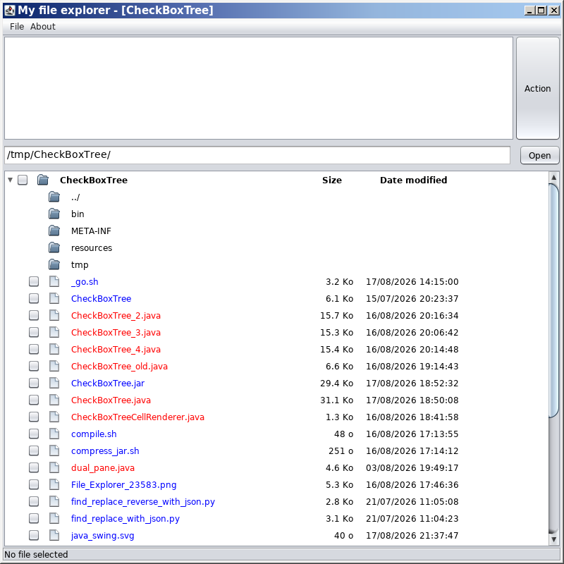

# CheckBoxTree - Version 1.0

[-yellow.svg)](https://openjdk.org/projects/jdk8/)

# Summary

An example of a treeview file explorer written in Java Swing with checkboxes for each file in the directory.

__Author__: Eric Normandin (2026)  

## License

This project is distributed under the terms of the GPL-2.0 License.

